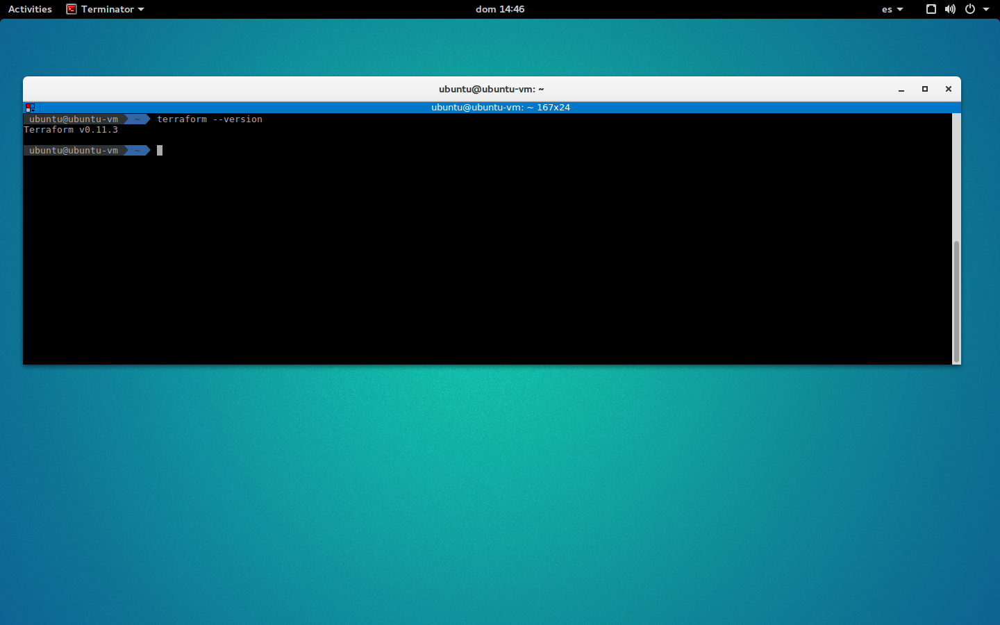

## Deploying a Kubernetes Cluster to ONE with Ansible and Terraform

### Installation information

####  Installing Terraform 

To install Terraform, find the appropriate package for your system and download it

	$ curl -O  https://releases.hashicorp.com/terraform/0.11.3/terraform_0.11.3_linux_amd64.zip

After downloading Terraform, unzip the package

	$ mkdir /bin/terraform
	$ unzip terraform_0.11.3_linux_amd64.zip -d /bin/terraform/


After installing Terraform, verify the installation worked by opening a new terminal session and checking that terraform is available. 

	$ export PATH=$PATH:/bin/terraform
	$ terraform --version



####  Installing Terraform provider Opennebula

You need to install go first: https://golang.org/doc/install

Install Prerequisites

	$ yum install bzr

Use the wget command and the link from Go to download the tarball:

	$ wget https://dl.google.com/go/go1.10.linux-amd64.tar.gz


The installation of Go consists of extracting the tarball into the `/usr/local` 

	$ tar -C /usr/local -xvzf  go1.10.linux-amd64.tar.gz 

We will call our workspace directory projects, but you can name it anything you would like. The -p flag for the mkdir command will create the appropriate directory tree

	$ mkdir -p ~/projects/{bin,pkg,src}

To execute Go like any other command, we need to append its install location to the $PATH variable.

	$ export PATH=$PATH:/usr/local/go/bin

Additionally, define the GOPATH and GOBIN Go environment variables:
	
	$ export GOBIN="$HOME/projects/bin"
	$ export GOPATH="$HOME/projects/src"

After go is installed and set up, just type:

    $ go get github.com/runtastic/terraform-provider-opennebula
    $ go install github.com/runtastic/terraform-provider-opennebula

#### Optional post-installation Step

Copy your **terraform-provider-opennebula** binary in a folder, like `/usr/local/bin`, and write this in `~/.terraformrc`:

	$ cp ~/projects/bin/terraform-provider-opennebula /usr/local/bin/terraform-provider-opennebula

```
providers {
  opennebula = "$YOUR_PROVIDER_PATH"
}
```

Example for `/usr/local/bin`:

```
providers {
  opennebula = "/usr/local/bin/terraform-provider-opennebula"
}
```


Created by:

Miguel Ángel Flores - (miguel.angel.flores@csuc.cat)

