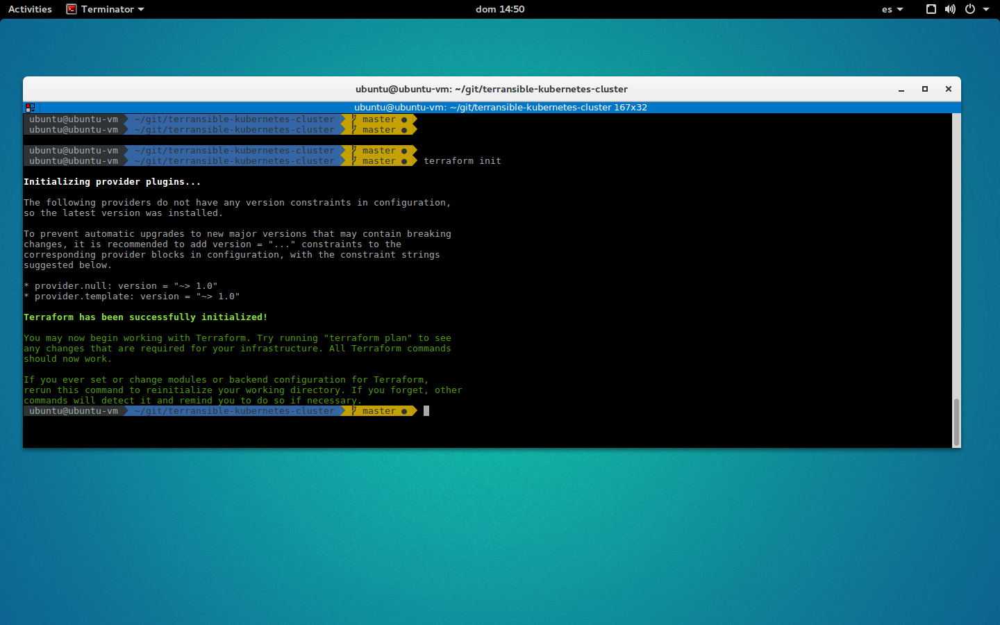
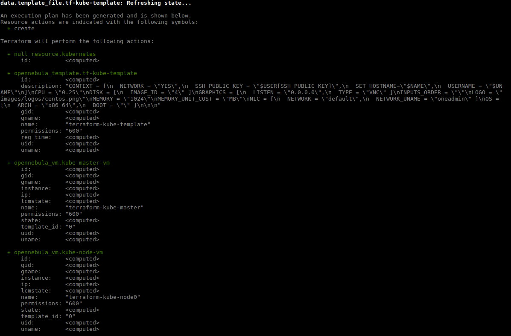
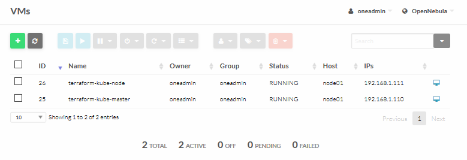

## Deploying a Kubernetes Cluster to ONE with Ansible and Terraform

### Installation information

####  Installing Terraform 

To install Terraform, find the appropriate package for your system and download it

	$ curl -O  https://releases.hashicorp.com/terraform/0.11.3/terraform_0.11.3_linux_amd64.zip

After downloading Terraform, unzip the package

	$ sudo mkdir /bin/terraform
	$ sudo unzip terraform_0.11.3_linux_amd64.zip -d /bin/terraform/


After installing Terraform, verify the installation worked by opening a new terminal session and checking that terraform is available. 

	$ export PATH=$PATH:/bin/terraform
	$ terraform --version


####  Installing Terraform provider Opennebula

You need to install go first: https://golang.org/doc/install

Install Prerequisites

	$ sudo apt install bzr

Use the `wget` command and the link from Go to download the tarball:

	$ wget https://dl.google.com/go/go1.10.linux-amd64.tar.gz


The installation of Go consists of extracting the tarball into the `/usr/local` 

	$ sudo tar -C /usr/local -xvzf  go1.10.linux-amd64.tar.gz 

We will call our workspace directory projects, but you can name it anything you would like. The `-p` flag for the `mkdir` command will create the appropriate directory tree

	$ mkdir -p ~/projects/{bin,pkg,src}

To execute Go like any other command, we need to append its install location to the $PATH variable.

	$ export PATH=$PATH:/usr/local/go/bin

Additionally, define the GOPATH and GOBIN Go environment variables:
	
	$ export GOBIN="$HOME/projects/bin"
	$ export GOPATH="$HOME/projects/src"

After go is installed and set up, just type:

    $ go get github.com/runtastic/terraform-provider-opennebula
    $ go install github.com/runtastic/terraform-provider-opennebula

#### Optional post-installation Step

Copy your **terraform-provider-opennebula** binary in a folder, like `/usr/local/bin`, and write this in `~/.terraformrc`:

	$ sudo cp ~/projects/bin/terraform-provider-opennebula /usr/local/bin/terraform-provider-opennebula

```
providers {
  opennebula = "$YOUR_PROVIDER_PATH"
}
```

Example for `/usr/local/bin`:

```
providers {
  opennebula = "/usr/local/bin/terraform-provider-opennebula"
}
```

#### Install Ansible

We can add the Ansible PPA by typing the following command:

	$ sudo apt-add-repository ppa:ansible/ansible

Next, we need to refresh our system's package index so that it is aware of the packages available in the PPA. Afterwards, we can install the software:

	$ sudo apt-get update
    $ sudo apt-get install ansible


### Deploy a Kubernetes cluster

Terraform code is written in a language called HCL in files with the extension “.tf”. It is a declarative language, so your goal is to describe the infrastructure you want, and Terraform will figure out how to create it.

This repository provide an Ansible playbook to Build a Kubernetes cluster with kubeadm. The goal is easily install a Kubernetes cluster on machines running `CentOS 7`

	$ git clone https://github.com/mangelft/terransible-kubernetes-cluster.git

First, initialize Terraform for your project. This will read your configuration files and install the plugins for your provider:

	$ terraform init




In a terminal, go into the folder where you created main.tf, and run the `terraform plan` command:



The plan command lets you see what Terraform will do before actually doing it.

To actually create the instance, run the `terraform apply` command:



The last step is to complete the cluster life cycle by removing your resources, do: `terraform destroy`

Created by:

Miguel Ángel Flores - (miguel.angel.flores@csuc.cat)

